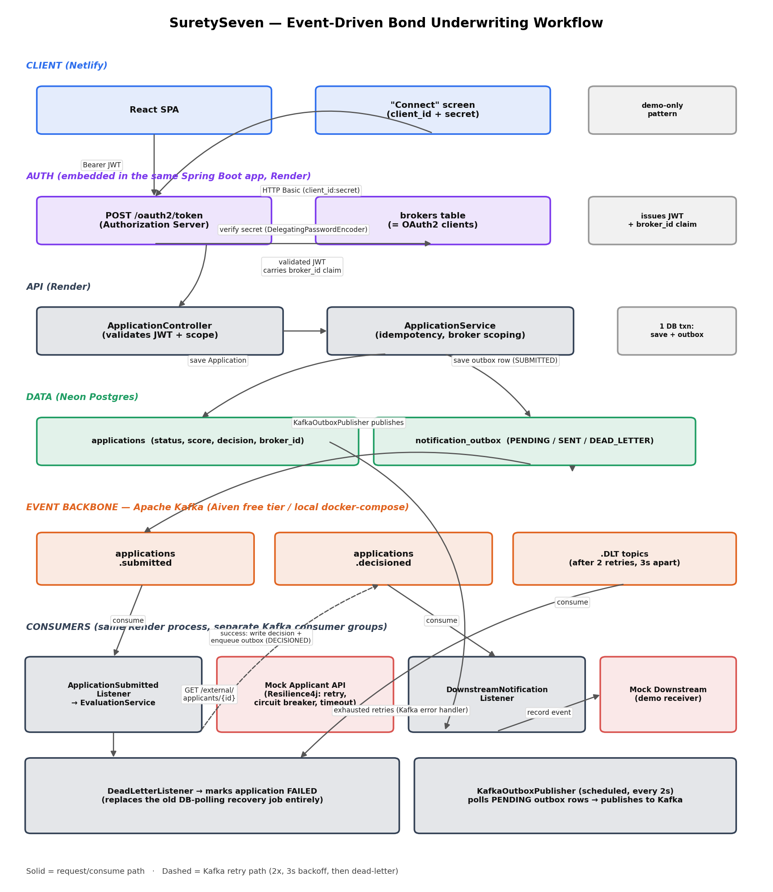

# Architecture

## 1. Overview

An event-driven REST API: Spring Boot + PostgreSQL for state, Apache Kafka for
moving work between stages, and embedded Spring Authorization Server for
per-broker OAuth2 authentication. Every stage transition (application submitted
→ evaluated → decisioned → notified) is a Kafka event rather than an in-process
method call, and the transactional outbox pattern makes sure a database commit
and a Kafka publish are never observably out of sync with each other.

This is a deliberate step up from a simpler "synchronous REST + in-process
async" design (which is *also* a perfectly reasonable answer to this
assignment). The trade-off is real: this version has more moving parts, more
infrastructure to run, and more failure modes to reason about. §8 and §9 say
plainly where that complexity earns its keep and where it doesn't yet.

## 2. Major components

| Component | Responsibility |
|---|---|
| `ApplicationController` | REST surface: `POST /applications`, `GET /applications/{id}`, `GET /applications` — protected by OAuth2 scopes |
| `AuthorizationServerConfig` / `BrokerRegisteredClientRepository` | Embedded OAuth2 Authorization Server; every broker is an OAuth2 client, issued at `POST /oauth2/token` |
| `ResourceServerConfig` | Validates bearer tokens and enforces `applications.read`/`applications.write` scopes on every request |
| `ApplicationService` | Validates, generates the business ID, enforces idempotency, stamps `brokerId`, persists `SUBMITTED` + an outbox row in one transaction |
| `KafkaOutboxPublisher` | Scheduled job draining the outbox onto the correct Kafka topic, with its own retry/backoff/dead-letter |
| `ApplicationSubmittedListener` | Kafka consumer: the ONLY thing that starts evaluation (replaces the old `@Async` fire-and-forget) |
| `EvaluationService` + `ScoringService` | Calls the external Applicant API, scores, decides; failures propagate to Kafka's error handler rather than being swallowed |
| `ApplicationSubmittedDeadLetterListener` | Consumes the `.DLT` topic once Kafka gives up retrying; the only path that marks an application `FAILED` |
| `DownstreamNotificationListener` | Kafka consumer standing in for "the downstream system" — no HTTP webhook involved |
| `MockApplicantController` / mock downstream event store | Stand-ins for the two external systems |

## 3. Data flow

1. Broker calls `POST /oauth2/token` with HTTP Basic (`client_id:client_secret`)
   and gets back a short-lived (15 min) JWT carrying a `broker_id` claim.
2. Broker calls `POST /applications` with `Authorization: Bearer <token>`.
   Requires the `applications.write` scope.
3. In ONE transaction: persist `Application` (status `SUBMITTED`, `brokerId`
   stamped from the token) and an outbox row (`eventType=APPLICATION_SUBMITTED`).
   Return `201` immediately — the caller does not wait for underwriting.
4. `KafkaOutboxPublisher` (polling every 2s) publishes the outbox row to the
   `applications.submitted` topic, keyed by `applicationId`.
5. `ApplicationSubmittedListener` consumes it and calls `EvaluationService`:
   status → `IN_REVIEW`, call the (Resilience4j-wrapped) Applicant API, score,
   decide.
6. On success: `EvaluationPersistence.finalizeDecision()` writes the final
   status/score/decision **and** a new outbox row
   (`eventType=APPLICATION_DECISIONED`) — again, one transaction.
7. On failure: status → `NEEDS_ATTENTION`, and the exception is **rethrown**
   so Spring Kafka's error handler can retry the listener invocation (2×, 3s
   apart) before giving up and routing the message to
   `applications.submitted.DLT`.
8. `ApplicationSubmittedDeadLetterListener` consumes the dead-letter topic (if
   reached) and marks the application `FAILED`.
9. `KafkaOutboxPublisher` also drains `APPLICATION_DECISIONED` rows onto
   `applications.decisioned`; `DownstreamNotificationListener` consumes them.
10. The frontend polls `GET /applications/{id}` (scoped to the caller's own
    `brokerId`) every 2s while in-flight.

## 4. API design

- `POST /oauth2/token` — standard OAuth2 client-credentials token endpoint
  (Spring Authorization Server), not custom code.
- `POST /applications` — `201` on creation, `200` on idempotent replay (see
  `Idempotency-Key`), `400` on validation failure, `401` missing/invalid
  token, `403` wrong scope.
- `GET /applications/{id}` — `404` for both "doesn't exist" and "exists but
  belongs to another broker" (see §7) — the caller can't distinguish the two.
- `GET /applications` — paginated (`page`, `size`, `sort`), scoped to the
  caller's own applications only.
- Errors share one shape (`ApiError`) with a stable `error` code and the
  request's `correlationId`.
- `GET /external/applicants/{id}` and `GET /mock/downstream/events` are the
  mocked external systems, not part of the "real" API surface, and are not
  behind OAuth2 (a real external partner API/consumer wouldn't be issued
  *our* broker tokens).

## 5. Persistence model

- **`applications`** — one row per application; the row *is* the state
  machine. Now also carries `broker_id` (indexed), the OAuth2 `client_id` of
  the submitting broker, enforced on every read.
- **`notification_outbox`** — generic outbox table, carrying BOTH
  `APPLICATION_SUBMITTED` and `APPLICATION_DECISIONED` events (see
  `KafkaTopics` for the eventType→topic mapping). One publisher, one
  retry/backoff/dead-letter policy, for both.
- **`brokers`** — each row IS an OAuth2 registered client
  (`BrokerRegisteredClientRepository` bridges this directly to Spring
  Authorization Server's `RegisteredClientRepository` contract — there's no
  separate client-registration table). Broker onboarding is out of scope;
  brokers are seeded via Flyway (`V2__oauth2_brokers.sql`).

Schema is Flyway-managed, not `ddl-auto=update`.

## 6. Failure-handling strategy

| Failure | Behavior |
|---|---|
| Applicant API timeout / 5xx / malformed body | Resilience4j retry (3×) + circuit breaker inside `ApplicantClient`, same as before |
| Retries exhausted inside one evaluation attempt | `EvaluationService` marks `NEEDS_ATTENTION` and **rethrows** |
| Kafka listener throws | Spring Kafka's `DefaultErrorHandler` retries the listener invocation in-process (2×, 3s backoff) before routing to `<topic>.DLT` |
| All Kafka-level retries exhausted | `ApplicationSubmittedDeadLetterListener` marks the application `FAILED` — this fully replaces the old DB-polling recovery job |
| Process crashes mid-evaluation | The Kafka offset for `applications.submitted` was never committed (offsets commit only after a successful listener return), so the message is redelivered to another consumer on rebalance — no separate recovery mechanism needed. `EvaluationService`'s terminal-status guard makes a redelivery of an *already-finished* message a safe no-op. |
| Outbox row fails to publish to Kafka (broker unreachable) | `KafkaOutboxPublisher`'s own retry/backoff/dead-letter (independent of the consumer-side Kafka retry above — different failure domain: "can't reach Kafka at all" vs "a message on Kafka failed to process") |
| Downstream notification consumer fails repeatedly | `applications.decisioned.DLT` — logged, does not affect the underlying decision, which was already committed |
| Duplicate submitted request | Unique `idempotency_key` constraint, same as before |
| Broker requests another broker's application | `404`, not `403` — never confirms the ID exists (see §7) |

## 7. Authentication & authorization

**Authentication**: Real OAuth2 client-credentials. Every broker is an OAuth2
client (`brokers` table). Tokens are JWTs signed with an RSA key generated at
app startup, validated by the resource server sharing the *same in-memory
`JWKSource` bean* — no HTTP round-trip (even to itself) is needed to validate
a token, avoiding a startup-order chicken-and-egg problem that a naive
issuer-uri-based setup would hit.

**Authorization** is two separate, deliberately-not-conflated layers:
- **Scopes** (coarse): `applications.write` to create, `applications.read` to
  read/list — enforced in `ResourceServerConfig`'s filter chain. A broker
  granted only one can genuinely not perform the other action.
- **Row-level ownership** (fine): a broker can only ever see applications
  where `broker_id` matches their own token's `broker_id` claim — enforced in
  `ApplicationService`, not the filter chain, because "is this specific ID
  yours" is a data question the filter chain can't answer for path-parameter
  IDs.

**Known limitation, stated plainly**: client-credentials is a
machine-to-machine grant. The frontend's "Connect as a Broker" screen, where a
human types a client secret into a browser form, is a demo convenience — a
real broker integration calls this API server-to-server and never exposes a
secret client-side. See `README.md` and the in-app banner on that screen.

## 8. Key trade-offs

- **Kafka instead of in-process async.** Buys: genuine crash recovery via
  consumer redelivery (no custom recovery job needed), built-in retry/backoff
  via `DefaultErrorHandler`, and a real decoupling point where a downstream
  team's own service could consume `applications.decisioned` directly with
  zero code changes here. Costs: another piece of infrastructure to run and
  reason about (partition assignment, consumer groups, at-least-once
  semantics), and end-to-end latency for one application is now
  outbox-poll-interval + Kafka-round-trip higher than a direct in-process
  call would be (still low single-digit seconds — invisible to a human
  underwriter, but not free).
- **Outbox pattern retained even with Kafka in the picture.** Publishing to
  Kafka directly inside the same transaction as a DB write is not possible
  (they're different systems); publishing right after commit, without an
  outbox, reintroduces the dual-write problem outboxing exists to solve. The
  cost is a second polling job (`KafkaOutboxPublisher`) and a small amount of
  added latency.
- **Embedded Authorization Server, not a separate service or a third-party
  IdP.** Zero extra infrastructure to host for free; the cost is a
  freshly-generated (not persisted) signing key, meaning a restart
  invalidates outstanding tokens — acceptable given they're 15-minute
  client-credentials tokens anyway, but a real deployment would persist the
  key.
- **Scopes are broker-wide, not per-application.** Simpler; the alternative
  (fine-grained, per-resource OAuth2 scopes) is overkill at this scale and
  ownership-based row filtering already does the real work.

## 9. What I'd change at 100x traffic

- **Kafka**: move off Aiven's free tier (fixed throughput ceiling, no SLA) to
  a provisioned cluster; partition topics by expected broker volume rather
  than a flat `3`.
- **Evaluation workers**: `ApplicationSubmittedListener` currently runs
  in-process alongside the API; at scale this becomes its own horizontally
  scaled consumer-group deployment, so a traffic spike on `POST /applications`
  can't starve evaluation capacity.
- **Persist the Authorization Server's signing key** (e.g. in the DB or a
  secrets manager) so a rolling restart doesn't invalidate in-flight tokens,
  and consider shorter-lived tokens with a `client_credentials` refresh
  pattern if request volume per broker gets very high (redundant token
  fetches otherwise become their own load).
- **Read replicas / caching** for `GET /applications/{id}` polling, still the
  highest-volume read path.
- **Broker onboarding API** with a proper admin credential, replacing the
  current Flyway-seed-only approach.
- **Rate limiting and per-broker quotas**, deliberately out of scope here.
